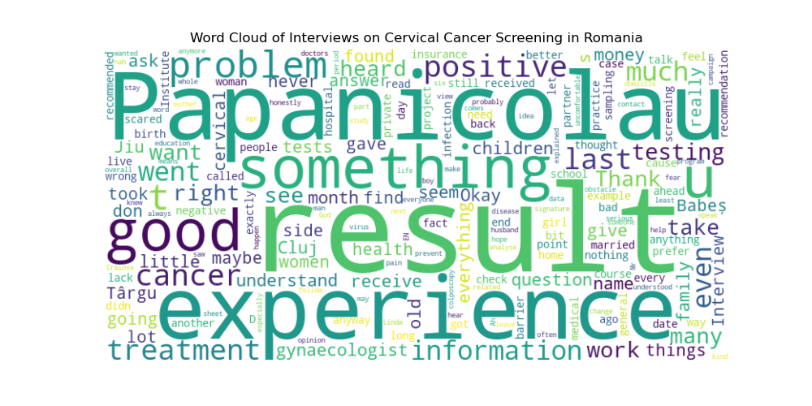

# HPV Qualitative Research Analysis

## Introduction

This repository contains the dataset and analysis notebook for a qualitative research study on HPV prophylaxis. The study focuses on improving prevention through early education and communication, based on a series of semi-structured interviews. The dataset includes detailed responses from participants, coded and analyzed for key insights. The analysis notebook provides comprehensive qualitative analysis using industry-standard procedures.

> **Note:** The dataset and analysis at current date of 2024-07-03 are partially completed (26 of 42 interviews processed)  and subject to further updates and refinements.



## Methodology

For analyzing the experiences and perceptions of women in Romania regarding cervical cancer screening and follow-up care, we will use a thematic analysis approach. This methodology is suitable for identifying, analyzing, and reporting patterns (themes) within the data, which allows us to provide a rich, detailed, and nuanced account of the data.

The thematic analysis process will involve the following steps:

1. **Familiarization with the Data**:
   - Reviewing the interviews to understand the content and context of the responses.
   - Identifying key variables and potential themes.

2. **Generating Initial Codes**:
    - Coding the data to identify interesting features or patterns.
    - Creating initial codes based on the content of the responses.

3. **Searching for Themes**:
    - Collating codes into potential themes.
    - Reviewing and refining themes to ensure they accurately represent the data.

4. **Defining, naming, reviewing Themes**:
    - Checking the themes against the coded extracts and the entire dataset.
    - Ensuring the themes work in relation to the coded extracts and the dataset as a whole.


## Dataset Information

1. **Participant_ID**: Unique identifier for each participant.
2. **Age**: Age of the participant.
3. **Domicile**: Residence of the participant (Urban/Rural).
4. **Marital_Status**: Marital status of the participant.
5. **Children_Count**: Number of children (alive and deceased).
6. **Occupation**: Participant's occupation.
7. **Health_Insurance**: Whether the participant has health insurance.
8. **Employment_Status**: Employment status of the participant.
9. **Family_Doctor**: Whether the participant has a family doctor.
10. **Primary_Healthcare_Use**: Initial use of primary healthcare (Yes/No).
11. **Private_Healthcare_Use**: Use of private healthcare for further tests (Yes/No).
12. **Education_Level**: Highest level of education completed.
13. **Heard_of_Cervical_Cancer**: Whether the participant has heard of cervical cancer (Yes/No).
14. **Heard_of_Testing_Programs**: Whether the participant has heard of testing programs (Yes/No).
15. **Performed_Preventive_Tests**: Whether the participant has performed preventive tests (Yes/No).
16. **Pap_Smear_Frequency**: Frequency of Pap smear tests (Annual, Sporadic, etc.).
17. **Last_Pap_Smear**: Date of the last Pap smear test.
18. **Heard_of_HPV_Test**: Whether the participant has heard of HPV test (Yes/No).
19. **Performed_HPV_Test**: Whether the participant has performed an HPV test (Yes/No).
20. **Pre_Test_Information_Source**: Source of information about cervical cancer and screening before testing.
21. **Project_Information_Source**: How the participant learned about the study.
22. **Reaction_to_Positive_Result**: Participant's reaction to receiving a positive test result.
23. **Consulted_with_Others**: Whether the participant consulted with others about the results (Yes/No).
24. **Follow_Up_Actions**: Actions taken after receiving the positive result.
25. **Interpretation_Aid**: Whether the participant sought help to interpret the results (Yes/No).
26. **Current_Recommendations**: Current medical recommendations for the participant.
27. **Sample_Collection_Method**: Method of sample collection for the HPV test (Self-sampling/Professional collection).
28. **Overall_Experience**: Overall experience with the testing process.
29. **Barriers_to_Testing**: Barriers to performing the HPV test.
30. **Barriers_to_Follow_Up**: Barriers in the follow-up and treatment process.
31. **Perception_of_Healthcare_Services**: Participant's perception of the healthcare services available.
32. **Preventive_Healthcare_Attitude**: Participant's attitude towards preventive healthcare.
33. **Knowledge_Acquisition_Method**: Method through which the participant acquires health-related knowledge.
34. **Perceived_Barriers_in_Healthcare**: Perceived barriers in accessing healthcare services.
35. **Impact_of_Urban_vs_Rural**: Differences in healthcare access between urban and rural areas.
36. **Support_System**: Description of participant's support system.
37. **Medical_Conditions**: Participant's existing medical conditions.
38. **Economic_Barriers**: Economic barriers faced by the participant.
39. **Transportation_Issues**: Issues related to transportation for accessing healthcare.
40. **Responsibility**: Participant's responsibility towards family.
41. **Healthcare_Seeking_Behavior**: Participant's behavior towards seeking healthcare.
42. **Overall_Insight**: Overall insights and reflections from the experience.


## Key Insights


### Key Insights from 26 Interviews at 2024-07-01

1. **Awareness and Knowledge of Cervical Cancer and HPV Testing**
   - **Limited Awareness:** Many participants had limited awareness of cervical cancer and the availability of preventive tests like the HPV test. For example, Participant 2 mentioned not knowing about preventive tests until being informed by a doctor.
   - **Sources of Information:** Information was primarily obtained from healthcare professionals rather than media or public health campaigns.

2. **Barriers to Accessing Healthcare**
   - **Financial Constraints:** Several participants reported financial barriers to accessing necessary healthcare services, including diagnostic tests and treatments.
   - **Healthcare Accessibility:** Geographic and logistical barriers were also significant, with some participants noting difficulties in accessing specialist care and diagnostic facilities.

3. **Emotional Reactions to Test Results**
   - **Anxiety and Fear:** Receiving a positive result for HPV or abnormal Pap smear results induced significant anxiety and fear among participants. For instance, Participant 6 described crying all day after receiving a positive HPV test result.
   - **Need for Emotional Support:** The need for better emotional support and clear communication from healthcare providers was highlighted, as participants often felt isolated and scared after receiving their results.

4. **Experiences with Healthcare Professionals**
   - **Mixed Experiences:** Participants reported varied experiences with healthcare professionals. While some felt well-supported and informed, others felt dismissed or inadequately informed. Participant 15 noted frustration with a doctor who did not explain medical terms clearly.
   - **Importance of Empathy and Communication:** Effective communication and empathetic behavior from healthcare providers were crucial in shaping positive healthcare experiences.

5. **Perceptions of Preventive Health Measures**
   - **Proactivity in Health Management:** Some participants expressed a proactive approach to managing their health by regularly attending screenings and follow-up appointments. Participant 15 emphasized the importance of regular check-ups and early intervention.
   - **Skepticism and Misinformation:** There was some skepticism and misinformation about the effectiveness and necessity of certain tests. For instance, Participant 2 mentioned hearing mixed opinions about the reliability of tests from other women.

#### **Themes and Sub-Themes Identified**

1. **Awareness and Knowledge**
   - Knowledge of cervical cancer
   - Awareness of HPV testing
   - Sources of health information

2. **Barriers to Access**
   - Financial constraints
   - Geographic and logistical barriers
   - Healthcare system navigation

3. **Emotional Reactions**
   - Anxiety and fear
   - Need for emotional support
   - Impact of test results on mental health

4. **Healthcare Professional Interactions**
   - Quality of communication
   - Empathy and support
   - Patient education and information dissemination

5. **Preventive Health Perceptions**
   - Proactive health behaviors
   - Skepticism and misinformation
   - Perceived importance of regular screenings

#### **Qualitative Analysis Results**

The detailed thematic analysis reveals that while there is some awareness of cervical cancer and HPV testing among women in Romania, significant gaps remain, particularly regarding understanding and accessing these services. Financial and logistical barriers are prominent, and the emotional burden of dealing with positive test results is substantial. Interactions with healthcare professionals play a crucial role in shaping experiences, highlighting the need for improved communication and empathetic care. Overall, there is a clear need for better education, accessible healthcare services, and emotional support for women undergoing cervical cancer screening and follow-up care.

## BibTeX Reference

```bibtex
@misc{damian2024hpv,
    author = {Andreea Damian},
    title = {HPV Qualitative Research Analysis},
    year = {2024},
    note = {Repository available on GitHub},
    howpublished = {\url{https://github.com/teal-andreea/HPV_Qualitative_Research_Analysis}},
    email = {itu.andreea@yahoo.com}
}
```
