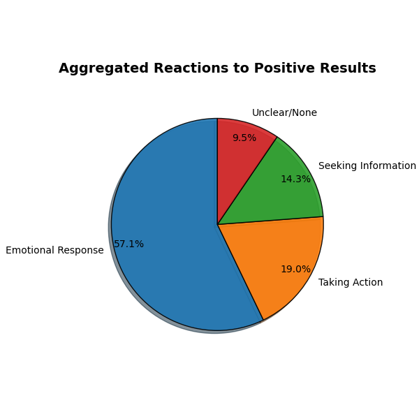
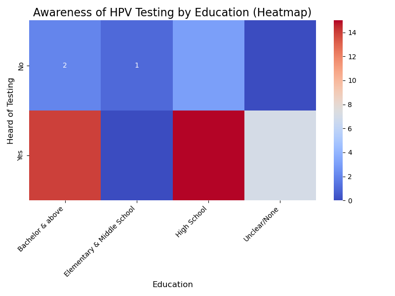
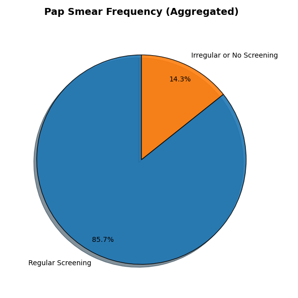

# HPV Qualitative Research Analysis

## Introduction

This repository contains the dataset and analysis notebook for a qualitative research study on HPV prophylaxis. The study focuses on improving prevention through early education and communication, based on a series of semi-structured interviews. The dataset includes detailed responses from participants, coded and analyzed for key insights. The analysis notebook provides comprehensive qualitative analysis using industry-standard procedures.

> **Note:** The dataset and analysis at current date of 2024-07-03 are partially completed (26 of 42 interviews processed)  and subject to further updates and refinements.


## Methodology

For analyzing the experiences and perceptions of women in Romania regarding cervical cancer screening and follow-up care, we will use a thematic analysis approach. This methodology is suitable for identifying, analyzing, and reporting patterns (themes) within the data, which allows us to provide a rich, detailed, and nuanced account of the data.

The thematic analysis process will involve the following steps:

1. **Familiarization with the Data**:
   - Reviewing the interviews to understand the content and context of the responses.
   - Identifying key variables and potential themes.

2. **Generating Initial Codes**:
    - Coding the data to identify interesting features or patterns.
    - Creating initial codes based on the content of the responses.

3. **Searching for Themes**:
    - Collating codes into potential themes.
    - Reviewing and refining themes to ensure they accurately represent the data.

4. **Defining, naming, reviewing Themes**:
    - Checking the themes against the coded extracts and the entire dataset.
    - Ensuring the themes work in relation to the coded extracts and the dataset as a whole.


## Key Insights


### Key Insights from 26 Interviews at 2024-07-01

1. **Awareness and knowledge of cervical cancer and HPV testing**
   - **Limited awareness:** Many participants had limited awareness of cervical cancer and the availability of preventive tests like the HPV test. For example, Participant 2 mentioned not knowing about preventive tests until being informed by a doctor.
   - **Sources of information:** Information was primarily obtained from healthcare professionals rather than media or public health campaigns.

2. **Barriers to accessing healthcare**
   - **Financial constraints:** Several participants reported financial barriers to accessing necessary healthcare services, including diagnostic tests and treatments.
   - **Healthcare accessibility:** Geographic and logistical barriers were also significant, with some participants noting difficulties in accessing specialist care and diagnostic facilities.

3. **Emotional reactions to test results**
   - **Anxiety and fear:** Receiving a positive result for HPV or abnormal Pap smear results induced significant anxiety and fear among participants. For instance, Participant 6 described crying all day after receiving a positive HPV test result.
   - **Need for emotional support:** The need for better emotional support and clear communication from healthcare providers was highlighted, as participants often felt isolated and scared after receiving their results.

4. **Experiences with healthcare professionals**
   - **Mixed rxperiences:** Participants reported varied experiences with healthcare professionals. While some felt well-supported and informed, others felt dismissed or inadequately informed. Participant 15 noted frustration with a doctor who did not explain medical terms clearly.
   - **Importance of empathy and communication:** Effective communication and empathetic behavior from healthcare providers were crucial in shaping positive healthcare experiences.

5. **Perceptions of preventive health measures**
   - **Proactivity in Health Management:** Some participants expressed a proactive approach to managing their health by regularly attending screenings and follow-up appointments. Participant 15 emphasized the importance of regular check-ups and early intervention.
   - **Skepticism and misinformation:** There was some skepticism and misinformation about the effectiveness and necessity of certain tests. For instance, Participant 2 mentioned hearing mixed opinions about the reliability of tests from other women.

#### **Themes and Sub-Themes Identified**

1. **Awareness and knowledge**
   - Knowledge of cervical cancer
   - Awareness of HPV testing
   - Sources of health information

2. **Barriers to access**
   - Financial constraints
   - Geographic and logistical barriers
   - Healthcare system navigation

3. **Emotional reactions**
   - Anxiety and fear
   - Need for emotional support
   - Impact of test results on mental health

4. **Healthcare professional interactions**
   - Quality of communication
   - Empathy and support
   - Patient education and information dissemination

5. **Preventive health perceptions**
   - Proactive health behaviors
   - Skepticism and misinformation
   - Perceived importance of regular screenings

#### **Qualitative analysis and quantitative results conclusion**

The detailed thematic analysis reveals that while there is some awareness of cervical cancer and HPV testing among women in Romania, significant gaps remain, particularly regarding understanding and accessing these services. Financial and logistical barriers are prominent, and the emotional burden of dealing with positive test results is substantial. Interactions with healthcare professionals play a crucial role in shaping experiences, highlighting the need for improved communication and empathetic care. 



Overall, there is a clear need for better education, accessible healthcare services, and emotional support for women undergoing cervical cancer screening and follow-up care. From a quantitative perspective, most respondents report negative emotional reactions (e.g., fear, worry), indicating that **fear** is a significant barrier preventing individuals from seeking HPV prophylaxis or testing. Once again, this could highlight the need for improved education and emotional support mechanisms in public health campaigns. 



On the other hand, analysis shows lower awareness of testing programs among respondents with lower education levels, pointing to a barrier where knowledge gaps prevent individuals from seeking HPV testing. Public health interventions should target educational outreach to increase awareness, particularly among **lower-educated populations**. 



A significant number of respondents categorized as "Irregular or No Screening" would suggest a major barrier in encouraging regular Pap smear testing, which is critical for cervical cancer prevention. Targeted reminders and accessible screening facilities could help improve regular participation in screening.

## Licensing

This repository is governed by the Apache 2.0 license. However, the data included in this repository cannot be used for commercial purposes or any other purposes without the consent of the author. You can can reach out to the author at itu.andreea@yahoo.com for further information.


## BibTeX Reference

```bibtex
@misc{damian2024hpv,
    author = {Andreea Damian},
    title = {HPV Qualitative Research Analysis},
    year = {2024},
    note = {Repository available on GitHub},
    howpublished = {\url{https://github.com/teal-andreea/investigate_knowledge_hpv}},
    email = {andreea@smartclover.ro}
}
```
